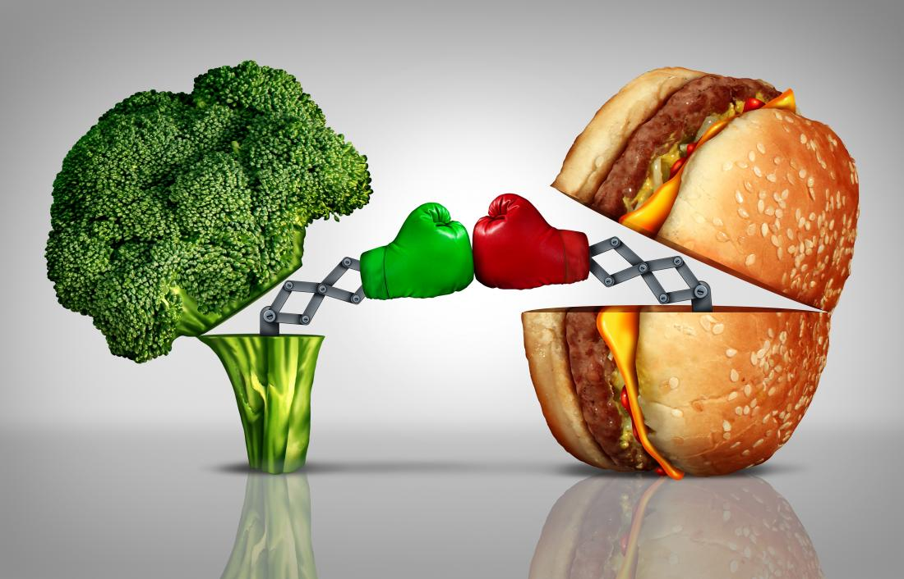

# VEGAN VS ANIMAL

#### KALE - YOUR ALTERNATIVE INFORMATION SOURCE FOR NUTRITION

**What [BIG FOOD](./BIG FOOD.md) is trying to hide from you!**

## VEGAN and ANIMAL work together!

They want you to believe that the VEGAN industry is fighting back against the MEAT industry. Nothing is further from the truth.

The general consensus is that the VEGAN industry is trying to fight back against the ANIMAL industry in an attempt to reduce the animal product consumption, in an attempt to "save the environment". This is all part of the mechanism that benefits both these industries.

The hoax that the environment needs saving encourages vigilente in those that believe in it. They try to convince others to also eat the way they do and cut out animal products. This might seem succesful as veganism is becoming more and more mainstream.

However what is clearly evident is that vegans are very annoying people and there is not just one effect, but two from their incessant nagging about the superiority of the vegan diet. What also occures is that people, most of whom are very recalcitrant in nature, don't like being told what to do.

People who don't convert to veganism will turn against all the moral superiority and will up their consumption of animal product. This leads to a situation in which both industries see massive profits as an effect of the hoax of veganism.

### Latest News Stories
 [SKITTLES aren't food, but PAINT!](./SKITTLES.md)

 [KALE ruins your creativity!](./KALE.md)

 [VEGAN and ANIMAL work together!](./VEGAN VS ANIMAL.md)

 [You should skip BREAKFAST!](./BREAKFAST.md)

___

###### [Home](./index.md)

###### All content of this website is part of [KALE](./KALE NEWS.md) and is copyrighted by [EGG](./EGG.md)

###### [Sitemap](./Sitemap.md)
